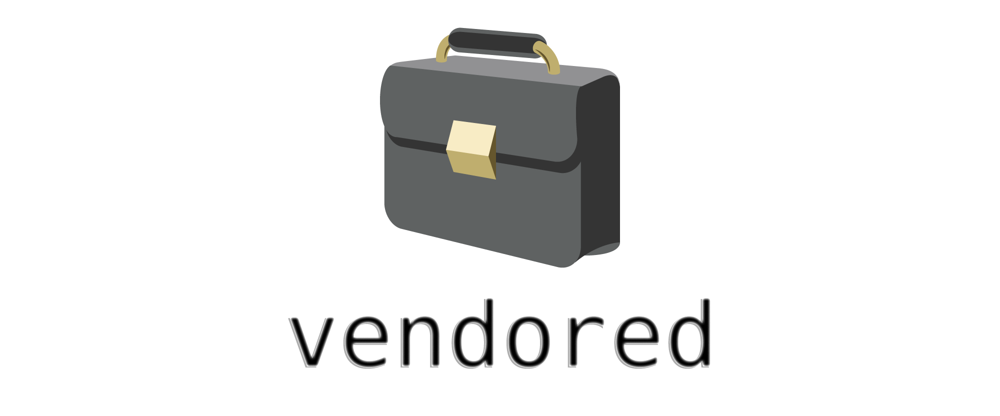

**THIS IS A WORK IN PROGRESS**



[](https://circleci.com/gh/clburlison/vendored)

The goal of this repo is to make it easy to "vendor" your own frameworks and programming languages in an automated fashion.

Once this project is complete you will be able to have own version of python, ruby, pyojbc bridge, OpenSSL, and more all in one nice big package or multiple smaller packages for easy deployment.

To keep track of progress look at the [Master list](https://github.com/clburlison/vendored/issues/1)

## Usage

Currently parts of this project are working. You can run `./build.py` to build and optionally package some of these pieces. Or `cd` into one of the subfolders and run `python setup.py` directly (the help is quite 'helpful'). This will give you the most control at this point until the build script matures and has more arguments added.

### Requires:
* Apple Command Line Tools (installable with `xcode-select --install`)
* Python 2

### Override
vendored was created to be customizable. As such, it is possible to override almost every option. These overrides live in the `config.ini` file.

The `config.ini` file contains two sections:
* `[DEFAULT]` which contains the default values
* `[override]` which will override values from the default section

A sample is shown below:

    base_install_path: /Library/CPE
    pkgid: com.clburlison
    sign_cert_cn: Developer ID Installer: Clayton Burlison

## Creating a patch
Some of these tools require patch files for compiling. If you're unfamiliar with creating a patch file the basics look a little something like:

```bash
diff -u hello.c hello_new.c > hello.c.patch
```

## Credits
Huge thanks to...
* the [Google MacOps](https://github.com/google/macops/) team for open sourcing their solution
* [@pudquick](https://github.com/pudquick) for his work on tlsssl so we can patch the native Python 2.7 that ships on macOS

This project uses works from:

| Author/Organization  |  Project Link |
|----------------------|---------------|
[@pudquick](https://github.com/pudquick) | [pudquick/tlsssl](https://github.com/pudquick/tlsssl)
[Munki](https://github.com/munki) | [munkilib](https://github.com/munki/munki/blob/master/code/client/munkilib/)
[Google Inc.](https://github.com/google/macops) | [google/macops packages](https://github.com/google/macops/tree/master/packages)
[EmojiOne](http://emojione.com/) | [briefcase](https://github.com/Ranks/emojione/blob/master/assets/png_512x512/1f4bc.png?raw=true)

## License

This project uses the MIT License.
